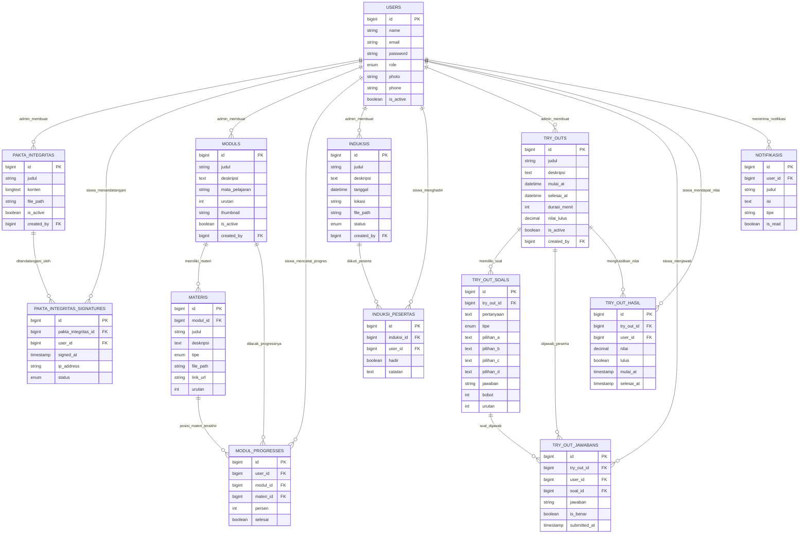

# 🌙 Bait Tahfiz Al-Qur'an Ridhallah (BTQR) — Website Profil & LMS Bahasa Arab

> Sistem website lengkap untuk **Bait Tahfiz Al-Qur'an Ridhallah (BTQR)** yang terdiri dari dua bagian:
> 1. **Website Profil Sekolah** — halaman publik pengenalan sekolah (seperti alazharcairobna.sch.id)
> 2. **LMS Bahasa Arab** — platform pembelajaran digital Bahasa Arab yang diakses melalui navigasi dari website profil

---

## 🏫 Tentang Sekolah

**Bait Tahfiz Al-Qur'an Ridhallah (BTQR)** adalah lembaga pendidikan Islam yang berfokus pada pembelajaran dan hafalan Al-Qur'an. Sistem ini dibangun untuk:
- Memperkenalkan sekolah kepada masyarakat luas melalui website profil publik
- Memfasilitasi pendaftaran siswa secara online
- Mendukung kegiatan pembelajaran melalui LMS terintegrasi

---

## 🗺️ Arsitektur Sistem & Alur Pengguna

```
┌──────────────────────────────────────────────────────┐
│         FRONTEND — Vue.js SPA                        │
│         http://localhost:5173                        │
│                                                      │
│  /            → Website Profil Publik                │
│  /profil      → Profil Sekolah                       │
│  /galeri      → Galeri                               │
│  /daftar      → Form Pendaftaran Siswa               │
│  /lms/login   → Halaman Login LMS  ────────┐         │
│  /lms/admin   → Panel Admin        ◄───────┤ (auth) │
│  /lms/siswa   → Dashboard Siswa    ◄───────┘         │
└────────────────────────┬─────────────────────────────┘
                         │  HTTP (Axios)
                         │  Bearer Token (Sanctum)
                         ▼
┌──────────────────────────────────────────────────────┐
│         BACKEND — Laravel REST API                   │
│         http://localhost:8000/api/*                  │
│                                                      │
│  /api/website/*   → Endpoint publik (tanpa auth)     │
│  /api/login       → Autentikasi                      │
│  /api/admin/*     → Endpoint Admin (auth + role)     │
│  /api/siswa/*     → Endpoint Siswa (auth + role)     │
└──────────────────────────────────────────────────────┘
```

---

## 🛠️ Tech Stack

> ⚠️ **Arsitektur Full Decoupled**: Backend dan Frontend berjalan di **folder & port terpisah**.
> Backend hanya melayani REST API, tidak ada Blade view. Semua tampilan dirender oleh Vue.js.

| Layer        | Teknologi                                  |
|--------------|---------------------------------------------|
| **Backend**  | Laravel 11 — **Pure REST API** (`/api/*`)   |
| **Frontend** | Vue.js 3 + Vite + TypeScript — **SPA**      |
| UI Library   | Tailwind CSS + shadcn/ui                    |
| Database     | MySQL / MariaDB                             |
| Auth         | Laravel Sanctum (Token + CORS)              |
| Storage      | Laravel Storage (lokal / S3)                |
| State        | Pinia                                       |
| HTTP Client  | Axios (dari frontend ke API backend)        |

---

## 🌐 Bagian 1 — Website Profil Sekolah (Publik)

Diakses di `http://localhost:5173/` tanpa login. Dirender sepenuhnya oleh Vue.js, data diambil dari Laravel API (`/api/website/*`). Bertujuan menampilkan informasi sekolah kepada publik dan memungkinkan calon siswa mendaftar.

### Halaman Website Profil

| Halaman       | URL (Vue Router)      | API (Laravel)                    |
|---------------|-----------------------|----------------------------------|
| Beranda       | `/`                   | `GET /api/website/konten`        |
| Profil        | `/profil`             | `GET /api/website/konten`        |
| Program       | `/program`            | `GET /api/website/konten`        |
| Galeri        | `/galeri`             | `GET /api/website/galeri`        |
| Pengumuman    | `/pengumuman`         | `GET /api/website/pengumuman`    |
| Kontak        | `/kontak`             | `GET /api/website/konten`        |
| Pendaftaran   | `/daftar`             | `POST /api/website/daftar`       |
| **Masuk LMS** | `/lms/login`          | `POST /api/login`                |

### Fitur Website Profil
- ✅ Tampilan responsif (mobile-friendly)
- ✅ Galeri foto kegiatan yang dapat dikelola admin
- ✅ Pengumuman publik dari sekolah
- ✅ Form pendaftaran siswa baru (dengan upload dokumen)
- ✅ Google Maps embed untuk lokasi sekolah
- ✅ Tombol navigasi **"Masuk ke LMS"** di navbar

---

## 📚 Bagian 2 — LMS Bahasa Arab

Diakses melalui `/lms` setelah login. Terdapat **2 role pengguna**:

| Role    | Akses Masuk          | Keterangan                                              |
|---------|----------------------|---------------------------------------------------------|
| `admin` | `/lms/admin`         | Mengelola seluruh konten LMS Bahasa Arab                |
| `siswa` | `/lms/siswa`         | Mengakses modul, pakta integritas, induksi, dan try out |

### 🗂️ Sidebar Admin (`/lms/admin`)

> Sidebar admin digunakan untuk mengelola seluruh konten dan pengguna pada LMS Bahasa Arab.

| # | Menu Sidebar         | Sub-halaman / Aksi                                               |
|---|----------------------|------------------------------------------------------------------|
| 1 | **Dashboard**        | Overview statistik siswa, modul aktif, notifikasi terbaru        |
| 2 | **Profil**           | `Lihat Profil Admin` · `Edit Profil` · `Ganti Password`          |
| 3 | **Pakta Integritas** | `List Peserta` · `Status Penandatanganan` · `Download Dokumen`   |
| 4 | **Modul**            | `List Modul` · `Tambah` · `Edit` · `Upload Materi` · `Hapus`     |
| 5 | **Induksi**          | `List Sesi Induksi` · `Tambah` · `Edit` · `Peserta Induksi`      |
| 6 | **Try Out**          | `List Try Out` · `Buat Soal` · `Edit` · `Rekap Nilai` · `Export` |

> Sub-halaman seperti **Tambah**, **Edit**, dan **Detail** tidak muncul sebagai item sidebar terpisah —
> melainkan diakses via tombol/aksi di dalam halaman List masing-masing (modal atau halaman baru).

---

### 🗂️ Sidebar Siswa/Peserta Didik (`/lms/siswa`)

> Tampilan sidebar siswa sesuai referensi antarmuka LMS Bahasa Arab seperti pada gambar.

| # | Menu Sidebar          | Sub-halaman / Aksi                                                          |
|---|-----------------------|-----------------------------------------------------------------------------|
| 1 | **Dashboard**         | Ringkasan progres mata pelajaran, modul selesai, jadwal mendatang, rata-rata nilai |
| 2 | **Profile**           | `Lihat Profil` · `Edit Profil` · `Ganti Password`                           |
| 3 | **Pakta Integritas**  | Lihat & tandatangani dokumen pakta integritas *(read-only setelah ditandatangani)* |
| 4 | **Modul**             | `List Modul per Mata Pelajaran` · `Baca/Download Materi` · `Progres Modul`  |
| 5 | **Induksi**           | Sesi orientasi/induksi peserta didik *(read-only)*                          |
| 6 | **Try Out**           | `List Try Out` · `Ikuti Try Out` · `Lihat Hasil`                            |

> **Catatan Tampilan Dashboard Siswa** (sesuai gambar):
> - Statistik: **Mata Pelajaran Aktif**, **Modul Selesai**, **Waktu Belajar (Jam Online)**, **Rata-rata Nilai**
> - Progres Mata Pelajaran: persentase penyelesaian per mata pelajaran
> - Jadwal Mendatang: daftar try out/induksi yang akan datang beserta tanggal

> Siswa **tidak memiliki akses** create/edit/delete pada data utama. Satu-satunya aksi write adalah **mengikuti try out**, **menandatangani pakta integritas**, dan **mengedit profil sendiri**.

---

## 🗄️ Skema Database

### Tabel Website Profil (Publik)

#### `website_contents` *(Konten halaman beranda/statis)*
| Kolom       | Tipe         | Keterangan              |
|-------------|--------------|-------------------------|
| id          | bigint PK    |                         |
| section     | varchar(50)  | hero/sambutan/visi_misi |
| judul       | varchar(200) |                         |
| konten      | longtext     |                         |
| gambar_path | varchar(255) |                         |
| urutan      | int          |                         |
| is_active   | boolean      |                         |

#### `galeris`
| Kolom      | Tipe         | Keterangan        |
|------------|--------------|-------------------|
| id         | bigint PK    |                   |
| judul      | varchar(200) |                   |
| deskripsi  | text         |                   |
| file_path  | varchar(255) | Gambar/video      |
| tipe       | enum         | foto/video        |
| kategori   | varchar(50)  | kegiatan/prestasi |
| is_active  | boolean      |                   |
| created_at | timestamp    |                   |

#### `pengumuman_publiks`
| Kolom        | Tipe         | Keterangan |
|--------------|--------------|------------|
| id           | bigint PK    |            |
| judul        | varchar(200) |            |
| konten       | text         |            |
| gambar_path  | varchar(255) |            |
| published_at | timestamp    |            |
| created_at   | timestamp    |            |

---

### Tabel Pengguna (LMS)

#### `users`
| Kolom      | Tipe         | Keterangan            |
|------------|--------------|-----------------------|
| id         | bigint PK    |                       |
| name       | varchar(100) | Nama lengkap          |
| email      | varchar(150) | Email (unique)        |
| password   | varchar(255) | Password hashed       |
| role       | enum         | **admin / siswa**     |
| photo      | varchar(255) | Path foto profil      |
| phone      | varchar(20)  | Nomor telepon         |
| is_active  | boolean      | Diaktifkan oleh admin |
| created_at | timestamp    |                       |
| updated_at | timestamp    |                       |

---

### Tabel Pakta Integritas

#### `pakta_integritas`
| Kolom      | Tipe         | Keterangan                     |
|------------|--------------|--------------------------------|
| id         | bigint PK    |                                |
| judul      | varchar(200) | Judul dokumen pakta integritas |
| konten     | longtext     | Isi/teks pakta integritas      |
| file_path  | varchar(255) | File PDF dokumen (opsional)    |
| is_active  | boolean      | Status aktif/berlaku           |
| created_by | bigint FK    | → users.id (admin)             |
| created_at | timestamp    |                                |
| updated_at | timestamp    |                                |

#### `pakta_integritas_signatures` *(Tanda tangan peserta)*
| Kolom               | Tipe        | Keterangan             |
|---------------------|-------------|------------------------|
| id                  | bigint PK   |                        |
| pakta_integritas_id | bigint FK   | → pakta_integritas.id  |
| user_id             | bigint FK   | → users.id (siswa)     |
| signed_at           | timestamp   | Waktu penandatanganan  |
| ip_address          | varchar(45) | IP saat tanda tangan   |
| status              | enum        | pending/signed         |

---

### Tabel Modul

#### `moduls`
| Kolom          | Tipe         | Keterangan                      |
|----------------|--------------|---------------------------------|
| id             | bigint PK    |                                 |
| judul          | varchar(200) | Judul modul                     |
| deskripsi      | text         | Deskripsi singkat modul         |
| mata_pelajaran | varchar(100) | Nama mata pelajaran Bahasa Arab |
| urutan         | int          | Urutan tampil                   |
| thumbnail      | varchar(255) | Gambar cover modul              |
| is_active      | boolean      |                                 |
| created_by     | bigint FK    | → users.id (admin)              |
| created_at     | timestamp    |                                 |
| updated_at     | timestamp    |                                 |

#### `materis` *(Materi/konten dalam modul)*
| Kolom      | Tipe         | Keterangan                |
|------------|--------------|---------------------------|
| id         | bigint PK    |                           |
| modul_id   | bigint FK    | → moduls.id               |
| judul      | varchar(200) | Judul materi              |
| deskripsi  | text         |                           |
| tipe       | enum         | dokumen/video/link        |
| file_path  | varchar(255) | Path file (PDF/video)     |
| link_url   | varchar(500) | URL jika tipe link        |
| urutan     | int          | Urutan materi dalam modul |
| created_at | timestamp    |                           |

#### `modul_progresses` *(Progress belajar siswa per modul)*
| Kolom      | Tipe      | Keterangan                               |
|------------|-----------|------------------------------------------|
| id         | bigint PK |                                          |
| user_id    | bigint FK | → users.id (siswa)                       |
| modul_id   | bigint FK | → moduls.id                              |
| materi_id  | bigint FK | → materis.id (materi terakhir dibuka)    |
| persen     | int       | 0-100 persentase selesai                 |
| selesai    | boolean   | Apakah modul sudah selesai               |
| updated_at | timestamp |                                          |

---

### Tabel Induksi

#### `induksis`
| Kolom      | Tipe         | Keterangan                   |
|------------|--------------|------------------------------|
| id         | bigint PK    |                              |
| judul      | varchar(200) | Judul sesi induksi           |
| deskripsi  | text         | Deskripsi sesi               |
| tanggal    | datetime     | Tanggal & waktu pelaksanaan  |
| lokasi     | varchar(255) | Lokasi / link meeting online |
| file_path  | varchar(255) | Materi/handout induksi       |
| status     | enum         | upcoming/berlangsung/selesai |
| created_by | bigint FK    | → users.id (admin)           |
| created_at | timestamp    |                              |
| updated_at | timestamp    |                              |

#### `induksi_pesertas` *(Peserta yang mengikuti induksi)*
| Kolom      | Tipe      | Keterangan          |
|------------|-----------|---------------------|
| id         | bigint PK |                     |
| induksi_id | bigint FK | → induksis.id       |
| user_id    | bigint FK | → users.id (siswa)  |
| hadir      | boolean   | Status kehadiran    |
| catatan    | text      | Catatan admin       |
| created_at | timestamp |                     |

---

### Tabel Try Out

#### `try_outs`
| Kolom        | Tipe         | Keterangan                |
|--------------|--------------|---------------------------|
| id           | bigint PK    |                           |
| judul        | varchar(200) | Judul try out             |
| deskripsi    | text         |                           |
| mulai_at     | datetime     | Waktu mulai try out       |
| selesai_at   | datetime     | Waktu berakhir try out    |
| durasi_menit | int          | Durasi pengerjaan (menit) |
| nilai_lulus  | decimal(5,2) | KKM / nilai minimum lulus |
| is_active    | boolean      |                           |
| created_by   | bigint FK    | → users.id (admin)        |
| created_at   | timestamp    |                           |
| updated_at   | timestamp    |                           |

#### `try_out_soals` *(Soal-soal dalam try out)*
| Kolom      | Tipe       | Keterangan              |
|------------|------------|-------------------------|
| id         | bigint PK  |                         |
| try_out_id | bigint FK  | → try_outs.id           |
| pertanyaan | text       | Teks soal               |
| tipe       | enum       | pilihan_ganda/essay     |
| pilihan_a  | text       | Pilihan A               |
| pilihan_b  | text       | Pilihan B               |
| pilihan_c  | text       | Pilihan C               |
| pilihan_d  | text       | Pilihan D               |
| jawaban    | varchar(1) | Jawaban benar (A/B/C/D) |
| bobot      | int        | Skor per soal           |
| urutan     | int        |                         |

#### `try_out_jawabans` *(Jawaban peserta per soal)*
| Kolom        | Tipe       | Keterangan                     |
|--------------|------------|--------------------------------|
| id           | bigint PK  |                                |
| try_out_id   | bigint FK  | → try_outs.id                  |
| user_id      | bigint FK  | → users.id (siswa)             |
| soal_id      | bigint FK  | → try_out_soals.id             |
| jawaban      | varchar(1) | Jawaban yang dipilih (A/B/C/D) |
| is_benar     | boolean    | Hasil koreksi otomatis         |
| submitted_at | timestamp  |                                |

#### `try_out_hasil` *(Rekap nilai akhir per peserta)*
| Kolom      | Tipe         | Keterangan                  |
|------------|--------------|-----------------------------|
| id         | bigint PK    |                             |
| try_out_id | bigint FK    | → try_outs.id               |
| user_id    | bigint FK    | → users.id (siswa)          |
| nilai      | decimal(5,2) | Nilai akhir                 |
| lulus      | boolean      | Lulus/tidak berdasarkan KKM |
| mulai_at   | timestamp    | Waktu mulai mengerjakan     |
| selesai_at | timestamp    | Waktu selesai mengerjakan   |

---

### Tabel Notifikasi

#### `notifikasis`
| Kolom      | Tipe         | Keterangan                       |
|------------|--------------|----------------------------------|
| id         | bigint PK    |                                  |
| user_id    | bigint FK    | → users.id                       |
| judul      | varchar(200) |                                  |
| isi        | text         |                                  |
| tipe       | varchar(50)  | modul/induksi/try_out/pakta/umum |
| is_read    | boolean      |                                  |
| created_at | timestamp    |                                  |

---

## 📐 Entity Relationship Diagram (ERD)



---

## 📁 Struktur Folder Proyek

```
btqr-lms/
│
├── backend/                                    # 🔧 Laravel 11 — Pure REST API
│   ├── app/
│   │   ├── Http/
│   │   │   ├── Controllers/Api/
│   │   │   │   ├── Website/                    # Publik (tanpa auth)
│   │   │   │   │   ├── WebsiteContentController.php
│   │   │   │   │   ├── GaleriController.php
│   │   │   │   │   ├── PengumumanPublikController.php
│   │   │   │   │   └── PendaftaranController.php
│   │   │   │   ├── Auth/
│   │   │   │   │   └── LoginController.php
│   │   │   │   ├── Admin/                      # LMS Admin
│   │   │   │   │   ├── DashboardController.php
│   │   │   │   │   ├── ProfilController.php         # show, update, gantiPassword
│   │   │   │   │   ├── PaktaIntegritasController.php # index, show, download
│   │   │   │   │   ├── ModulController.php          # index, store, show, update, destroy
│   │   │   │   │   ├── MateriController.php         # store, destroy (upload materi ke modul)
│   │   │   │   │   ├── InduksiController.php        # index, store, show, update, destroy
│   │   │   │   │   └── TryOutController.php         # index, store, show, update, destroy, rekap
│   │   │   │   └── Siswa/                      # LMS Siswa (mostly read-only)
│   │   │   │       ├── DashboardController.php
│   │   │   │       ├── ProfilController.php         # show, update, gantiPassword
│   │   │   │       ├── PaktaIntegritasController.php # show, sign
│   │   │   │       ├── ModulController.php          # index, show, updateProgress
│   │   │   │       ├── InduksiController.php        # index (read-only)
│   │   │   │       └── TryOutController.php         # index, show, submit, hasil
│   │   │   └── Middleware/
│   │   │       ├── IsAdmin.php
│   │   │       └── IsSiswa.php
│   │   └── Models/
│   │       ├── User.php
│   │       ├── PaktaIntegritas.php
│   │       ├── PaktaIntegritasSignature.php
│   │       ├── Modul.php
│   │       ├── Materi.php
│   │       ├── ModulProgress.php
│   │       ├── Induksi.php
│   │       ├── InduksiPeserta.php
│   │       ├── TryOut.php
│   │       ├── TryOutSoal.php
│   │       ├── TryOutJawaban.php
│   │       ├── TryOutHasil.php
│   │       └── Notifikasi.php
│   ├── database/
│   │   ├── migrations/
│   │   └── seeders/
│   ├── routes/
│   │   └── api.php              # Semua route REST API
│   └── config/
│       └── cors.php             # Izinkan request dari localhost:5173
│
└── frontend/                                   # 🎨 Vue.js 3 + Vite — SPA
    ├── src/
    │   ├── views/
    │   │   ├── website/                        # Halaman Publik
    │   │   │   ├── Beranda.vue
    │   │   │   ├── Profil.vue
    │   │   │   ├── Program.vue
    │   │   │   ├── Galeri.vue
    │   │   │   ├── Pengumuman.vue
    │   │   │   ├── Kontak.vue
    │   │   │   └── Pendaftaran.vue
    │   │   ├── auth/
    │   │   │   └── Login.vue
    │   │   ├── admin/                          # LMS — Panel Admin
    │   │   │   ├── Dashboard.vue               # Statistik modul, peserta, try out
    │   │   │   ├── profil/
    │   │   │   │   └── Index.vue               # Lihat & edit profil admin, ganti password
    │   │   │   ├── pakta-integritas/
    │   │   │   │   ├── Index.vue               # List peserta & status penandatanganan
    │   │   │   │   └── Show.vue                # Detail & download dokumen peserta
    │   │   │   ├── modul/
    │   │   │   │   ├── Index.vue               # List modul per mata pelajaran
    │   │   │   │   ├── Create.vue              # Tambah modul baru
    │   │   │   │   ├── Edit.vue                # Edit modul
    │   │   │   │   └── Show.vue                # Detail modul & upload materi
    │   │   │   ├── induksi/
    │   │   │   │   ├── Index.vue               # List sesi induksi
    │   │   │   │   ├── Create.vue              # Tambah sesi induksi
    │   │   │   │   ├── Edit.vue                # Edit sesi induksi
    │   │   │   │   └── Peserta.vue             # Daftar peserta induksi
    │   │   │   └── try-out/
    │   │   │       ├── Index.vue               # List try out
    │   │   │       ├── Create.vue              # Buat try out & soal
    │   │   │       ├── Edit.vue                # Edit soal try out
    │   │   │       └── Rekap.vue               # Rekap nilai & export
    │   │   └── siswa/                          # LMS — Panel Siswa (Peserta Didik)
    │   │       ├── Dashboard.vue               # Progres mapel, modul selesai, waktu belajar, nilai
    │   │       ├── profil/
    │   │       │   └── Index.vue               # Lihat & edit profil, ganti password
    │   │       ├── pakta-integritas/
    │   │       │   └── Index.vue               # Lihat & tandatangani pakta integritas
    │   │       ├── modul/
    │   │       │   ├── Index.vue               # List modul per mata pelajaran
    │   │       │   └── Show.vue                # Baca/download materi & progres modul
    │   │       ├── induksi/
    │   │       │   └── Index.vue               # Sesi induksi/orientasi peserta didik
    │   │       └── try-out/
    │   │           ├── Index.vue               # List try out aktif
    │   │           ├── Ikuti.vue               # Halaman mengerjakan try out
    │   │           └── Hasil.vue               # Hasil/nilai try out
    │   ├── components/
    │   │   ├── layouts/
    │   │   │   ├── WebsiteLayout.vue           # Layout navbar website publik
    │   │   │   ├── AdminLayout.vue             # Layout sidebar admin
    │   │   │   └── SiswaLayout.vue             # Layout sidebar siswa
    │   │   └── shared/
    │   ├── stores/
    │   │   ├── auth.ts
    │   │   └── app.ts
    │   ├── router/
    │   │   └── index.ts
    │   └── api/
    │       └── axios.ts
    ├── .env
    └── vite.config.ts
```

---

## 🔌 API Endpoints

### Publik (Website Profil — tanpa auth)
| Method | Endpoint                  | Keterangan                  |
|--------|---------------------------|-----------------------------|
| GET    | `/api/website/konten`     | Konten halaman publik       |
| GET    | `/api/website/galeri`     | Galeri foto/video           |
| GET    | `/api/website/pengumuman` | Pengumuman publik           |
| POST   | `/api/website/daftar`     | Submit formulir pendaftaran |

### Auth (LMS)
| Method | Endpoint       | Keterangan    |
|--------|----------------|---------------|
| POST   | `/api/login`   | Login         |
| POST   | `/api/logout`  | Logout        |
| GET    | `/api/profile` | Profil user   |
| PUT    | `/api/profile` | Update profil |

### Admin (butuh auth + role admin)
| Method | Endpoint                              | Keterangan                             |
|--------|---------------------------------------|----------------------------------------|
| GET    | `/api/admin/dashboard`                | Statistik ringkasan modul & peserta    |
| GET    | `/api/admin/profil`                   | Lihat profil admin                     |
| PUT    | `/api/admin/profil`                   | Update profil & ganti password         |
| GET    | `/api/admin/pakta-integritas`         | List peserta & status penandatanganan  |
| GET    | `/api/admin/pakta-integritas/{id}`    | Detail & download dokumen peserta      |
| GET    | `/api/admin/moduls`                   | List semua modul                       |
| POST   | `/api/admin/moduls`                   | Tambah modul baru                      |
| PUT    | `/api/admin/moduls/{id}`              | Edit modul                             |
| DELETE | `/api/admin/moduls/{id}`              | Hapus modul                            |
| POST   | `/api/admin/moduls/{id}/materi`       | Upload materi ke modul                 |
| DELETE | `/api/admin/moduls/{id}/materi/{mid}` | Hapus materi dari modul                |
| GET    | `/api/admin/induksi`                  | List sesi induksi                      |
| POST   | `/api/admin/induksi`                  | Tambah sesi induksi                    |
| PUT    | `/api/admin/induksi/{id}`             | Edit sesi induksi                      |
| DELETE | `/api/admin/induksi/{id}`             | Hapus sesi induksi                     |
| GET    | `/api/admin/induksi/{id}/peserta`     | Daftar peserta induksi                 |
| GET    | `/api/admin/try-out`                  | List try out                           |
| POST   | `/api/admin/try-out`                  | Buat try out baru & soal               |
| PUT    | `/api/admin/try-out/{id}`             | Edit try out & soal                    |
| DELETE | `/api/admin/try-out/{id}`             | Hapus try out                          |
| GET    | `/api/admin/try-out/{id}/rekap`       | Rekap nilai peserta try out            |

### Siswa/Peserta Didik (butuh auth + role siswa)
| Method | Endpoint                           | Keterangan                           |
|--------|------------------------------------|--------------------------------------|
| GET    | `/api/siswa/dashboard`             | Ringkasan progres & statistik siswa  |
| GET    | `/api/siswa/profil`                | Lihat profil diri sendiri            |
| PUT    | `/api/siswa/profil`                | Update profil & ganti password       |
| GET    | `/api/siswa/pakta-integritas`      | Lihat dokumen pakta integritas       |
| POST   | `/api/siswa/pakta-integritas/sign` | Tandatangani pakta integritas        |
| GET    | `/api/siswa/moduls`                | List modul per mata pelajaran        |
| GET    | `/api/siswa/moduls/{id}`           | Detail & baca materi modul           |
| POST   | `/api/siswa/moduls/{id}/progress`  | Update progress modul                |
| GET    | `/api/siswa/induksi`               | Sesi induksi/orientasi peserta didik |
| GET    | `/api/siswa/try-out`               | List try out aktif & selesai         |
| GET    | `/api/siswa/try-out/{id}`          | Detail soal try out                  |
| POST   | `/api/siswa/try-out/{id}/submit`   | Submit jawaban try out               |
| GET    | `/api/siswa/try-out/{id}/hasil`    | Lihat hasil/nilai try out            |

---

## 🔐 Hak Akses per Role

| Fitur                             | Admin | Siswa |
|-----------------------------------|:-----:|:-----:|
| Kelola Pakta Integritas           | ✅    | ❌    |
| Tanda tangan Pakta Integritas     | ❌    | ✅    |
| Kelola Modul (Materi Bahasa Arab) | ✅    | ❌    |
| Akses & progres Modul             | ✅    | ✅    |
| Kelola Sesi Induksi               | ✅    | ❌    |
| Ikuti Induksi (peserta)           | ❌    | ✅    |
| Buat & kelola Try Out             | ✅    | ❌    |
| Ikuti Try Out & lihat hasil       | ❌    | ✅    |
| Dashboard & laporan statistik     | ✅    | ✅    |

---

## 🚀 Cara Menjalankan Proyek

### Prerequisites
- PHP >= 8.2
- Composer
- Node.js >= 18
- MySQL / MariaDB
- XAMPP / Laragon

### 1. Backend — Laravel REST API
```bash
cd backend
composer install
cp .env.example .env
php artisan key:generate

# Konfigurasi .env:
# DB_DATABASE=btqr_lms
# DB_USERNAME=root
# SANCTUM_STATEFUL_DOMAINS=localhost:5173
# FRONTEND_URL=http://localhost:5173

php artisan migrate --seed
php artisan storage:link
php artisan serve
# ✅ API berjalan di: http://localhost:8000/api/*
```

### 2. Frontend — Vue.js SPA
```bash
cd frontend
npm install
cp .env.example .env

# Isi file .env:
# VITE_API_URL=http://localhost:8000

npm run dev
# ✅ Aplikasi berjalan di: http://localhost:5173
```

### Ringkasan Port
| Service                | URL                         |
|------------------------|-----------------------------|
| Laravel API            | `http://localhost:8000/api` |
| Vue.js (Website + LMS) | `http://localhost:5173`     |

> **CORS** sudah dikonfigurasi di `config/cors.php` Laravel agar frontend Vue.js di port 5173 bisa mengakses API backend di port 8000.

---

## 📅 Rencana Pengembangan (Roadmap)

| Fase | Fitur                                              | Status     |
|------|----------------------------------------------------|------------|
| 0    | Website Profil Publik (beranda, galeri, dll)       | 🔜 Planned |
| 1    | Autentikasi LMS (Admin & Siswa)                    | 🔜 Planned |
| 2    | Manajemen Pakta Integritas                         | 🔜 Planned |
| 3    | Manajemen Modul & Materi Bahasa Arab               | 🔜 Planned |
| 4    | Manajemen Induksi & Peserta                        | 🔜 Planned |
| 5    | Try Out Online (soal, submit, rekap nilai)         | 🔜 Planned |
| 6    | Dashboard Statistik & Notifikasi                   | 🔜 Planned |

---

## 👨‍💻 Developer

Dikembangkan sebagai bagian dari **Skripsi** untuk mendukung digitalisasi pendidikan di **Bait Tahfiz Al-Qur'an Ridhallah (BTQR)**.

Referensi desain website profil: [Al-Azhar Cairo BNA](https://alazharcairobna.sch.id/)
Referensi sistem LMS: [PPG Transformasi Kemenag RI](https://app.ppgkemenag.com/)

---

*© 2025–2026 BTQR — Bait Tahfiz Al-Qur'an Ridhallah. All rights reserved.*
